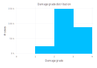

## Project goal and source

Derived from the 2015 Gorkha earthquake in Nepal the dataset holds information about buildings and their grade of damage.
Ultimate project goal is to be able to predict vulnerability of each house and learn more about contributing factors and their interaction.

More details about the project and data set can be found at [https://www.drivendata.org/competitions/57/nepal-earthquake/](https://www.drivendata.org/competitions/57/nepal-earthquake/)

## Damage grade

There are three grades of demage used:
    1. represents low damage
    2. represents a medium amount of damage
    3. represents almost complete destruction
The scale 'only' ordinal, the difference in degree of damage between 1 and 2 isn't neiscery the same as 2 to 3

#### Distribution in training set

